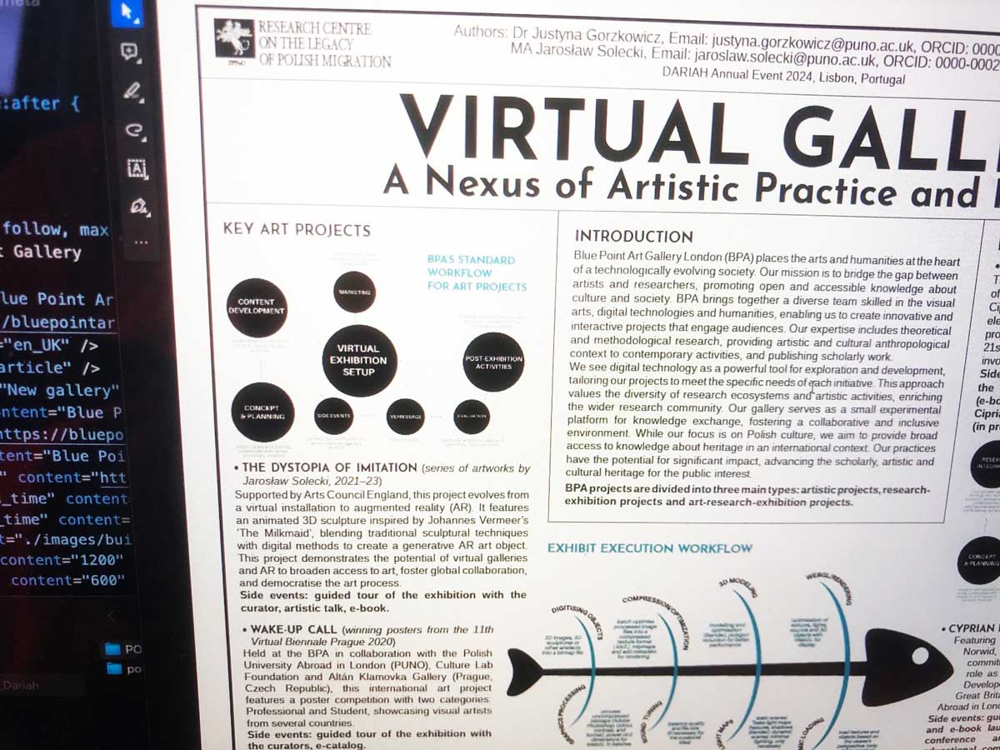

Showcasing the Blue Point Gallery Workflow at DARIAH 2024
We are thrilled to announce that our Blue Point Gallery Project will be featured at the prestigious DARIAH Annual Event 2024 in Lisbon, Portugal. This year's conference theme, "Workflows: Digital Methods for Reproducible Research Practices in the Arts and Humanities, " aligns perfectly with our project's mission to leverage digital technologies in creating immersive and engaging art experiences. Join us for "Virtual Gallery: A Nexus of Artistic Practice and Research" at DARIAH 2024:

Merging Art and Technology at the Virtual Blue Point Gallery The Blue Point Art Gallery London is breaking new ground by integrating conceptual art with cutting-edge digital methodologies and technologies. This innovative virtual gallery, developed during the COVID-19 pandemic, serves as a dynamic platform for creative expression, research, and public engagement. Powered by WebGL, JavaScript, HTML, and CSS, the gallery offers an immersive 3D experience accessible directly through web browsers. No additional software is required, democratizing access to the artworks on display.

The Dystopia of Imitation: A Pioneering Project A highlight of the gallery is the pioneering project 'The Dystopia of Imitation', which transitions from a virtual 3D sculptural installation inspired by Vermeer's 'The Milkmaid' to an augmented reality (AR) generative art piece. This groundbreaking work exemplifies the convergence of traditional sculpture with digital methodologies, blurring the lines between physical and virtual realms. The multimodal approach combines sculptural practices, digital techniques, and poetic curation, culminating in a virtual exhibition at the Blue Point Gallery and an extension into the metaverse. Visitors can explore sculptural fragments scattered across multiple domains, guided by a comprehensive e-catalogue documenting the artistic and research processes.

Reproducible Artistic Research A key achievement is establishing a precedent for reproducibility in artistic research. By meticulously documenting each phase – from conceptual sketches to digital execution and public engagement – the project offers a replicable model for art research practices. Additionally, protocols were implemented for digitizing and annotating 3D models with consistent metadata, facilitating archival practices in digital art repositories and cultural heritage projects. An open-source AR framework further promotes interoperability in educational and museum contexts. The Blue Point Gallery's innovative approach enhances art accessibility, fosters global collaboration among artists and researchers, and democratizes artistic production and consumption. This pioneering work contributes to a broader understanding of digital workflows in the arts and humanities, advocating for seamless technology integration in creative practices.

