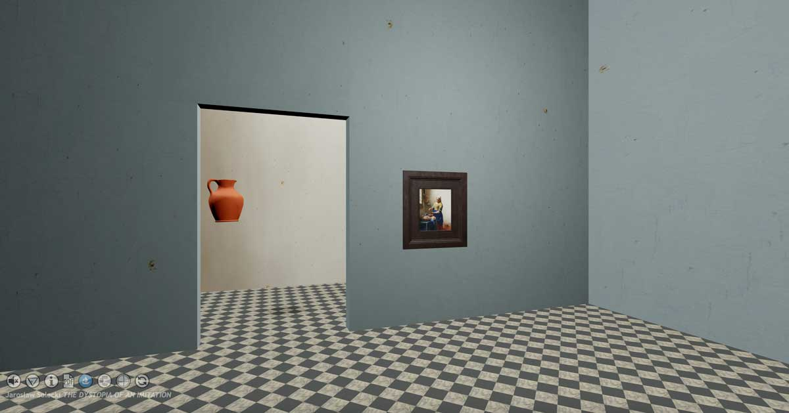

From a single artwork, Dystopia of Imitation has developed into a series that addresses different aspects of my creative explorations. On the one hand, these are artistic experiments, the search for sculptural material or various sculptural techniques, and on the other, the need to carve through structures and digital objects using code, driven by curiosity about what happens at the interface between virtual worlds and the technology that links them into one dynamic Metavers.

"The dystopia of imitation" has not only become the name for a series of artworks, it is evolving in to my personal Metavers.

The installation [&#39; Vermeer&#39; s Pitcher&#39; ](https://dystopiaofimitation.bluepointart.uk/) in the 'Dystopia of imitation' series has been enriched with sounds.

It has also been linked to the Metavers where I place objects created during my work on the Dystopia Project. Dystopia has found its place in [Spatial](https://www.spatial.io/s/Dystopia-Of-Imitation-629b4d6d2dce760001dfedfd?share=159258300144248758), [Voxels](https://www.voxels.com/play?coords=E@1807W,979S), [Superworld.](https://dystopiaofimitation.eth.limo/dystopia-of-imitation-on-superworld.html)

The project was also given an address on the Etherium network [dystopiaofimitation.eth](https://dystopiaofimitation.eth.limo/) and installation objects were transformed into NFTs (Opensea).

  

