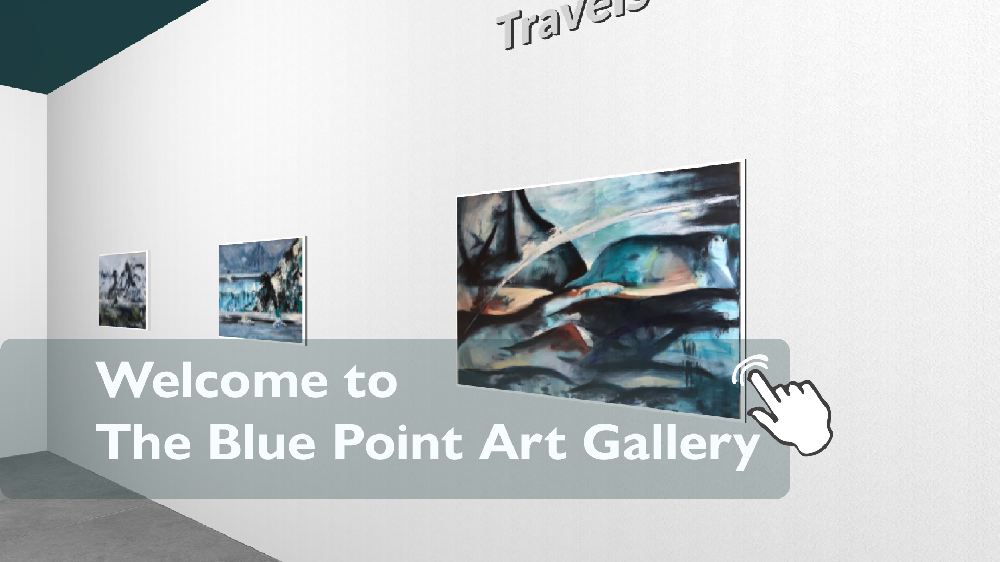

Joanna Ciechanowska’s works presented at the Lockdowns exhibition offer a specific understanding of isolation. They are anchored in multi-dimensional references to social and historical time, but above all – to personal time. Despite revealing fears related to participating in an unknown situation, they steer clear of catastrophism. They become the artist’s inner painting and poetic journey. They are a flash of rediscovery of those few simple images in the presence of which the human heart is closedand opened for the first time.

Lets meet Joanna Ciechanowska

The bilingual publication, containing a longer theoretical and curatorial text and an album with the artist’s works: Justyna Gorzkowicz, Towards rediscovery: LOCKDOWNS – Joanna Ciechanowska  / W stronę ponownego odkrycia: LOCKDOWNS – Joanna Ciechanowska 
Full version of the book will come soon at PUNO Press.

[EXCERPT FROM CONTENTS / WYBÓR ZAWARTOŚCI – Free PDF](https://gateway.bluepointart.uk/ipfs/bafybeie4p55kauy6ejabn6dko3myb355isvzi6cnse37auzoupsdzh4q6m)

<iframe width="640" height="360" src="https://www.youtube.com/embed/hSF4PP65feU" title="Joanna Ciechanowska - LOCKDOWNS" frameborder="0" allow="accelerometer; autoplay; clipboard-write; encrypted-media; gyroscope; picture-in-picture; web-share" referrerpolicy="strict-origin-when-cross-origin" allowfullscreen></iframe>

 

<iframe width="640" height="360" src="https://www.youtube.com/embed/Zb0qnAwfcwQ" title="Blue Point Art Gallery, PUNO Londyn: Joanna Ciechanowska – Lockdowns" frameborder="0" allow="accelerometer; autoplay; clipboard-write; encrypted-media; gyroscope; picture-in-picture; web-share" referrerpolicy="strict-origin-when-cross-origin" allowfullscreen></iframe>

Project supported by the Polish Cultural Institute in London (PCI)

  

