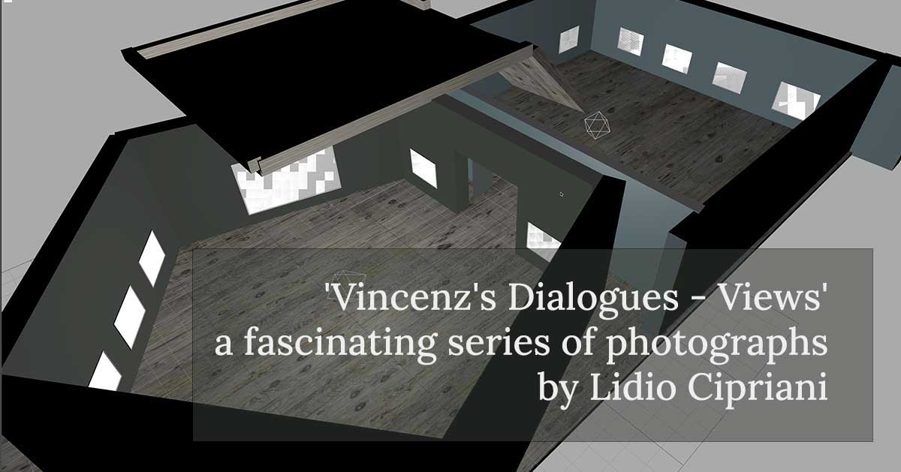

The exhibition 'Vincenz's Dialogues - Views' presents a fascinating series of photographs by Lidio Cipriani, who, following in the footsteps of Stanisław Vincenz, presented the Hutsul region in a completely new light. At the exhibition, we will see unusual photographs that go beyond the boundaries of traditional ethnographic and touring documentation.
The photographs are from the Lidio Cipriani archive, owned by Professor Jacopo Moggi-Cecchi of the University of Florence. We sincerely thank them for sharing the photos with us.

[https://vincenz.bluepointart.uk](https://vincenz.bluepointart.uk)
